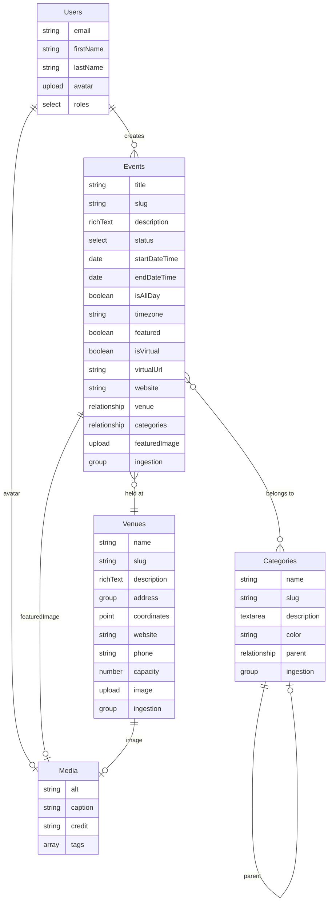

# RIOT Events - Data Model Plan

## Overview

RIOT Events is a Payload CMS application for managing event listings. The system supports:

- **Event management** by editors/curators in the CMS
- **Event ingestion** from a WordPress JSON API (The Events Calendar plugin)
- **AI enhancement** applied to ingested events (data cleanup, image finding)
- **User sessions** for event-attending users

## Architecture

## User Roles

| Role         | Description        | Permissions                                            |
| ------------ | ------------------ | ------------------------------------------------------ |
| **Admin**    | Full system access | Create/edit/delete all content, manage users and roles |
| **Editor**   | Content management | Create/edit/delete events, venues, categories, media   |
| **Attendee** | Public users       | Read published events, manage own profile              |

## WordPress API Integration

The system ingests events from a WordPress site running The Events Calendar plugin via the `/tribe/events/v1/` API endpoints.

### Field Mapping

**Events:**
| WordPress Field | Payload Field | Notes |
|----------------|---------------|-------|
| `id` | `ingestion.externalId` | WordPress post ID |
| `url` | `ingestion.externalUrl` | WordPress event URL |
| `title` | `title` | May contain HTML entities |
| `description` | `description` | HTML content |
| `start_date` | `startDateTime` | Local time |
| `end_date` | `endDateTime` | Local time |
| `timezone` | `timezone` | IANA timezone string |
| `all_day` | `isAllDay` | Boolean |
| `featured` | `featured` | Boolean |
| `is_virtual` | `isVirtual` | Boolean |
| `virtual_url` | `virtualUrl` | URL for virtual events |
| `website` | `website` | External link |
| `venue` | `venue` | Relationship |
| `categories` | `categories` | Relationship array |

**Venues:**
| WordPress Field | Payload Field | Notes |
|----------------|---------------|-------|
| `id` | `ingestion.externalId` | WordPress venue ID |
| `url` | `ingestion.externalUrl` | WordPress venue URL |
| `venue` | `name` | WP uses "venue" for name |
| `description` | `description` | HTML content |
| `address` | `address.street` | Street address |
| `city` | `address.city` | City |
| `province`/`state` | `address.state` | Normalized |
| `zip` | `address.zip` | Postal code |
| `country` | `address.country` | Country |
| `geo_lat`/`geo_lng` | `coordinates` | Point field |
| `phone` | `phone` | Phone number |
| `website` | `website` | Website URL |

**Categories:**
| WordPress Field | Payload Field | Notes |
|----------------|---------------|-------|
| `id` | `ingestion.externalId` | WordPress term ID |
| `name` | `name` | Category name |
| `slug` | `slug` | URL slug |
| `description` | `description` | Description |
| `parent` | `parent` | Self-referencing relationship |

## Access Control Strategy

### Collection-Level Access

| Collection | Read                       | Create  | Update        | Delete  |
| ---------- | -------------------------- | ------- | ------------- | ------- |
| Events     | Published or authenticated | Editor+ | Editor+       | Editor+ |
| Venues     | Public                     | Editor+ | Editor+       | Editor+ |
| Categories | Public                     | Editor+ | Editor+       | Editor+ |
| Media      | Public                     | Editor+ | Editor+       | Editor+ |
| Users      | Self or admin              | Admin   | Self or admin | Admin   |

### Field-Level Access

- **User roles**: Only admins can modify the `roles` field
- **Ingestion fields**: Read-only in admin UI (populated by sync)

## Future Considerations

### AI Enhancement Pipeline

Events ingested from WordPress can be flagged for AI enhancement:

- `ingestion.aiEnhanced`: Boolean flag
- `ingestion.aiEnhancedAt`: Timestamp of last enhancement

Planned enhancements:

1. Data cleanup (HTML entity decoding, formatting)
2. Image sourcing for events lacking featured images
3. Category suggestion/auto-tagging
4. Description summarization

### Additional Features

- Event series/recurring events
- Organizer collection
- Ticket integration
- User favorites/saved events
- Event check-ins/attendance tracking
